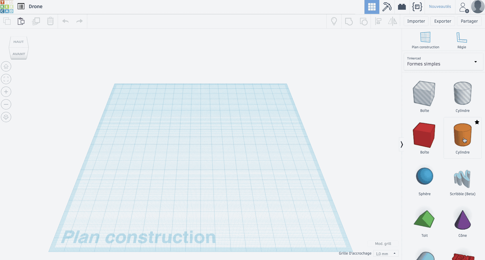
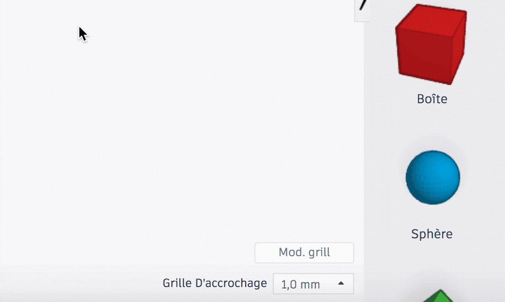
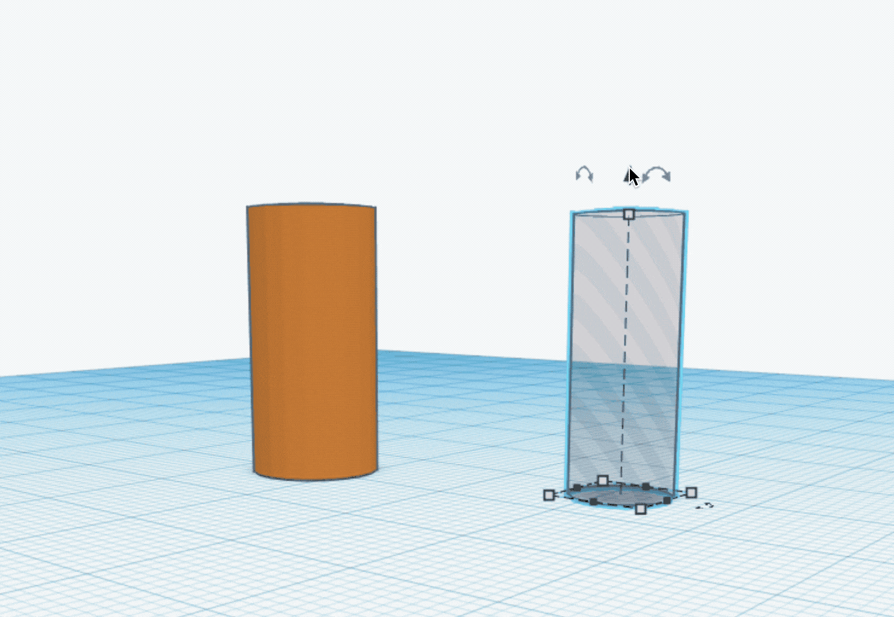
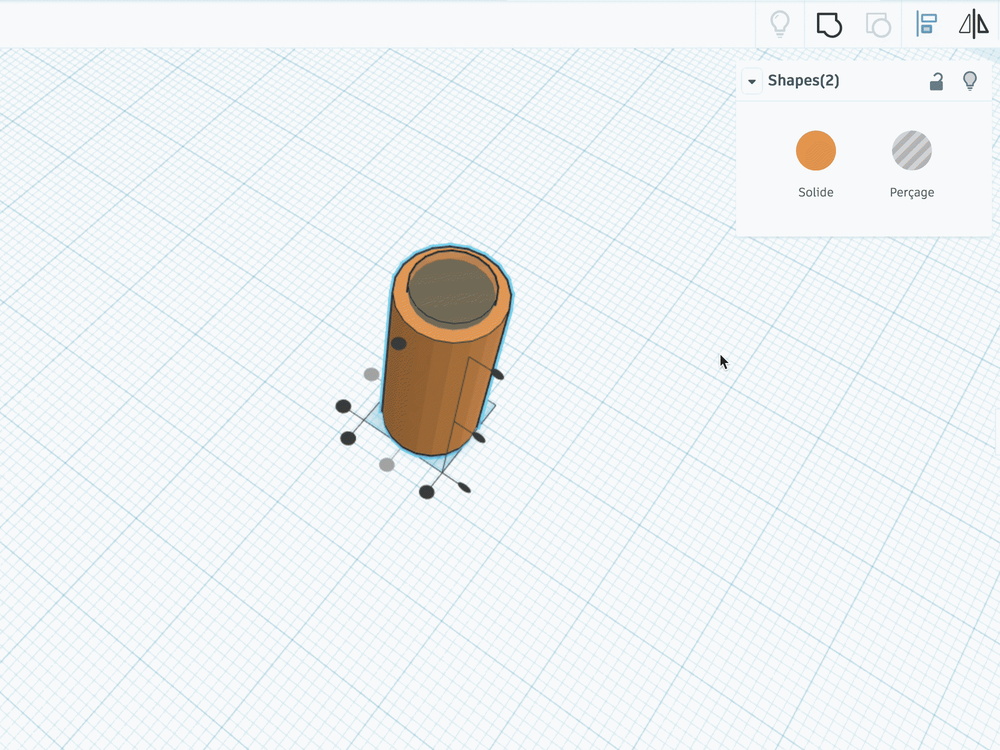
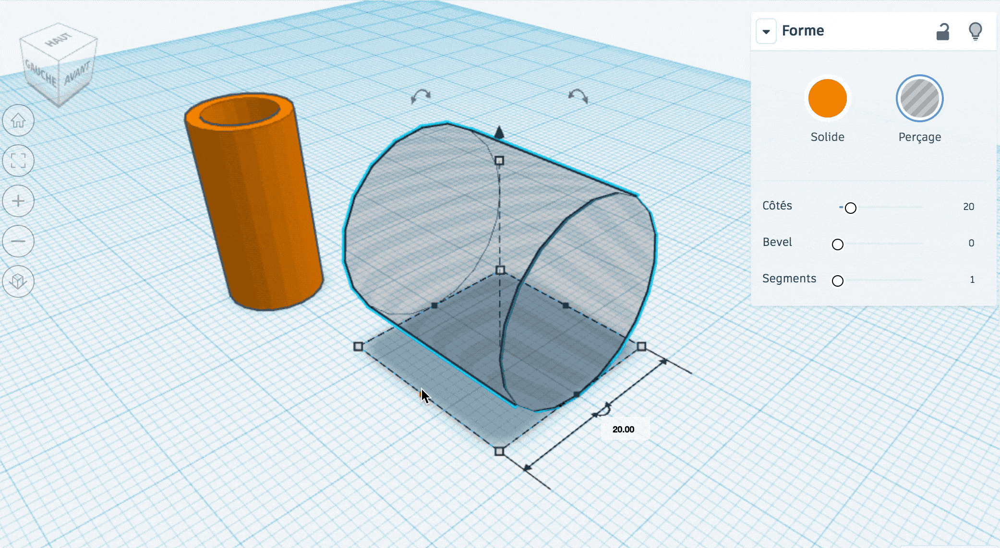
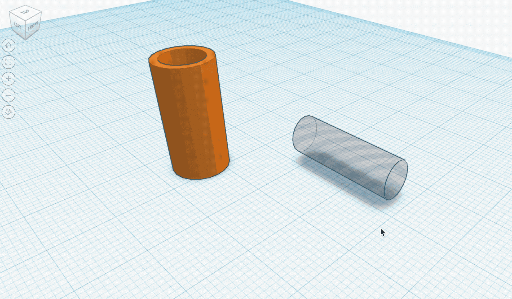
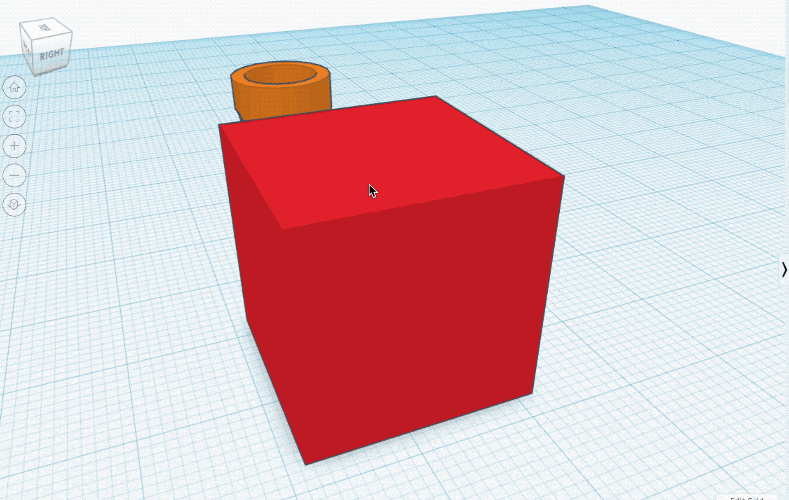

# **Pour réaliser le bras du drone :**

## **Étape 1 : Créer un cylindre**

Faire glisser le cylindre orange du panneau latéral de droite sur le plan de construction.

Cliquer sur les rectangles blancs pour donner au cylindre, une base de 10.00 en largeur et en profondeur, la hauteur n’a pas besoin d’être modifiée.

D’autre part, il faut modifier le réglage de la grille en cliquant sur la boîte située en bas à droite et à côté de
« Grille d’accrochage 1,0 mm» et sélectionner 0,25 mm.  

Puis, sélectionner le cylindre gris dans le panneau de droite.  
Toujours à l’aide des carrés blancs, il faut changer sa base en 7.50 en largeur et en profondeur.

À l’aide de la flèche noire au sommet, surélever le cylindre de 2.00 en hauteur par rapport au plan de travail.  

## **Étape 2 : Extruder le cylindre orange**

En maintenant le bouton gauche de la souris, sélectionner les deux cylindres.
Ils devraient apparaître tous deux entourés d’un trait couleur cyan.
Appuyer sur le bouton « Aligné » ( ou bien la touche L ).  
Une grille de sélection apparaît sur le rectangle au niveau du plan de travail,  cliquer sur les cercles se situant au milieu des segments du rectangle.  Le cylindre gris se situe maintenant au milieu du cylindre orange.

Sélectionner ensuite l’icône « Regrouper » en haut à droite ( ou la touche Ctrl + G )

Le cylindre orange est maintenant creux.

## **Étape 3 : Ajouter des aérations**

Par conséquent, il faut prendre le cylindre gris du panneau latéral.
Grâce aux doubles flèches courbes, il est nécessaire d’effectuer une rotation de 90°.

Lui donner ensuite une hauteur de 7.00, une largeur de 6.00 et une profondeur de 20.00.
Grâce à la flèche noire, le surélever de 1.00.

Avec l’outil aligné, mettre le cylindre gris au centre du cylindre orange.

Dupliquer le cylindre gris avec le bouton en haut à gauche ( ou la touche Ctrl + D ) et grâce à la flèche noire, le surélever de 10.00.

Sélectionner les trois cylindres et cliquer de nouveau sur « Regrouper ».

Le cylindre orange est maintenant percé de quatre ovales.

## **Étape 4 : Réaliser le bras**

Sélectionner la boîte rouge dans le panneau latéral droit.

Après l’avoir placée sur le plan de travail, il faut lui donner une largeur de 6.50, une hauteur de 6.50 et une profondeur de 20.00.

Prendre un cube gris, il est nécessaire de lui donner les dimensions suivantes :
3.25 en largeur, 3.25 hauteur et 10 profondeur.

Insérer le rectangle gris dans le rectangle rouge en sélectionnant les deux rectangles, puis avec l'outil "aligner", centrer le rectangle gris au bord du rectangle orange en cliquant les points noirs situés à mi-auteur, au milieu et enfin au bord gauche du rectangle rouge

Déplacer en arrière le rectangle rouge de 1.00 sans le déplacer latéralement, puis regrouper les deux rectangles.  
(Pro tip : Presser la touche Shift après avoir cliqué avec la souris permet de verrouiller le déplacement dans une seule direction)

Maintenant, cliquer sur la forme "biseau" et la poser sur le plan de construction, effectuer ensuite à cette forme une rotation de 90° de sa base vers la gauche et une autre rotation de 90° vers le bas  sur son axe vertical.

Donner au biseau une hauteur de 13.50 et une largeur de 6.50

Faire fusionner avec l'outil "aligner" le rectangle et le biseau.

Surélever le rectangle de 13.50 pour le poser sur le biseau et regrouper les deux pièces entre elles.

Aligner cette nouvelle pièce avec le cylindre précédemment extrudé

 Déplacer la pièce de 8.25 vers la droite et fusionner l'ensemble

La pièce est maintenant terminée !
