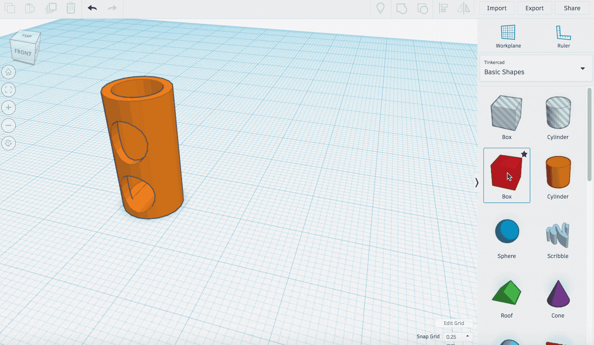
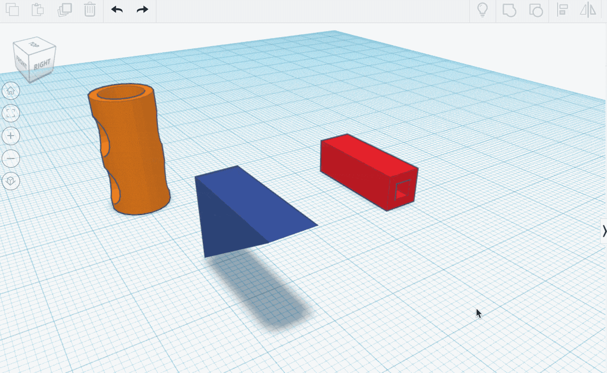
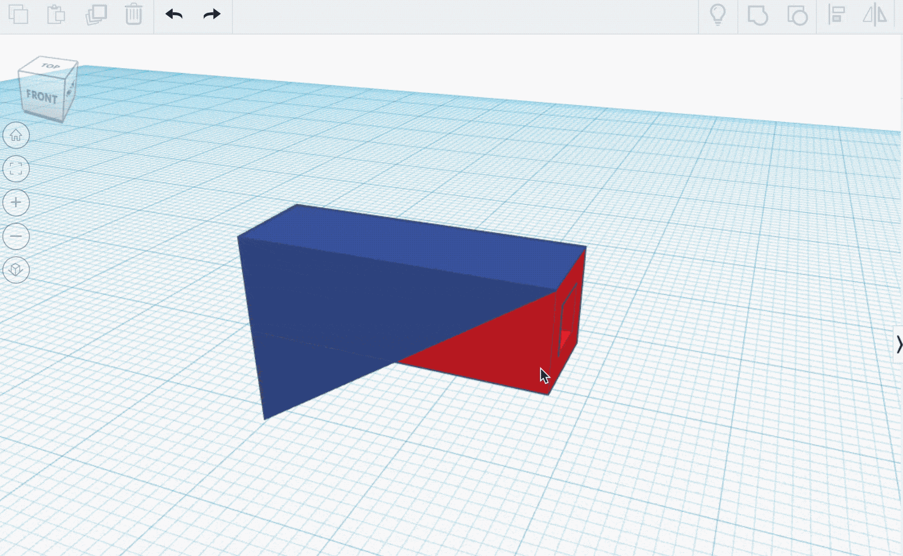

# **How to Make the Drone Arm :**

## **Step 1: Create a cylinder**

Slide the orange cylinder from the right side panel onto the workplane.

Click on the white rectangles to give the cylinder, a base of 10.00 mm in width and depth, the height does not need to be changed.

On the other hand, you have to change the setting of the grid by clicking on the box located at the bottom right and next to
"Snap grid 1.0 mm" and select 0.25 mm.

Then, select the gray cylinder in the right panel.
Also, again using the white squares, it is necessary to change its base in 7.50 mm in width and 7.50 mm in depth.

Using the black arrow at the top, elevate the cylinder by 2.00 mm in height from the workplane.

## **Step 2: Extrude the orange cylinder**

Holding the left mouse button, select both cylinders.
They should both appear with a cyan line.
Press the "Align" button (or the L key).
A selection grid appears on the rectangle at the level of the workplan, click on the circles located in the middle of the segments of the rectangle. The gray cylinder is now in the middle of the orange cylinder.

Then select the "Group" icon at the top right (or the Ctrl + G key)

The orange cylinder is now hollow.

## **Step 3: Add some vents**

Therefore, take the gray cylinder of the side panel.
Thanks to the double curved arrows, rotate it to 90 °.

Then, you need to give it a height of 7.00 mm, a width of 6.00 mm and a depth of 20.00 mm.
With the black arrow, raise it by 1.00 mm.

With the "align" tool, place the gray cylinder in the center of the orange cylinder.

Duplicate the gray cylinder with the button at the top left (or the Ctrl + D key) and with the black arrow, raise it by 10.00 mm.

Select the three cylinders and click on "Group" again.

The orange cylinder is now pierced by four ovals.

## **Step 4: Make the drone arm**

Select the red box in the right side panel.

After having placed it on the workplane, it must be given a width of 6.50 mm, a height of 6.50 mm and a depth of 20.00 mm.

Take a gray cube, it is necessary to give it the following dimensions:
3.25 mm in width, 3.25 mm in height and 10.00 mm in depth.

Insert the gray rectangle in the red rectangle by selecting the two rectangles, then with the "align" tool, center the gray rectangle at the edge of the orange rectangle by clicking the black spots located mid-height, middle and finally at the left edge red rectangle.

Move back the red rectangle of 1.00 mm without moving it laterally, then group the two rectangles together.
(Pro tip: Pressing the ⇧ SHIFT key after clicking with the mouse locks the movement in one direction )

Now, click on the shape "bevel" and put it on the workplane, then perform on this form a 90 ° rotation of its base to the left and another rotation of 90 ° down on its vertical axis.

Give the bevel a height of 13.50 mm and a width of 6.50 mm.

Merge with the tool "align" the rectangle and the bevel.

Raise the 13.50 mm rectangle to place it on the bevel and group the two pieces together.

Align this new piece with the previously extruded cylinder.

Move the 8.25 mm piece to the right and merge the set.

Now you have a functional mechanical part !
